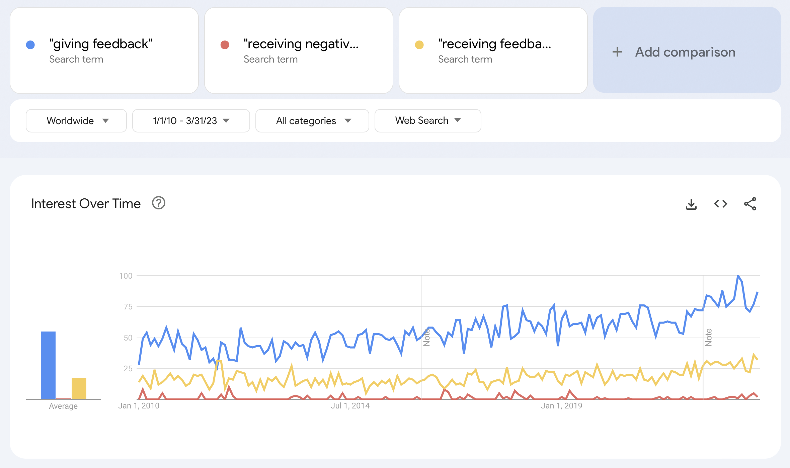

---
cover:
  relative: true
  image: ignore-think-target.webp
  alt: The emojis 🙉 🤔 🎯 side-by-side in a vibrant, abstract style with bold brush strokes, in a dynamic background that features deep blues, bright oranges, and contrasting whites, creating a sense of movement and energy.
  caption: "“Draw the emojis 🙉 🤔 🎯 in an abstract expressionism art style” [(DALL·E)](https://openai.com/dall-e)"
date: 2023-04-10T07:07:28Z
lang: en
source: "[Equal Experts Blogin post, Hugo Ferreira, 2019-04-18](https://equalexperts.blogin.co/posts/65986)"
tags: [ guidelines, feedback, compassion, empathy, ego ]
title: Hearing or listening? Unlock the value of receiving feedback
summary: Most information on feedback focuses on how to give negative feedback. But what about receiving negative feedback? How better would it be if both ends shared the burden of having productive conversations? Let's put our egos to the side and be emphatic with those who give us criticism, so the burden isn’t on the speaker alone.
series: [ feedback ]
---

Whenever the topic of feedback comes up, the emphasis is usually on how to *give feedback* in an effective way.

The concerns are also usually about *negative feedback*. It’s quite easy to give praise or positive feedback to people, since they receive it very well in general.

The internet is full of advice and frameworks to help us shape our message in a way that people receive it well. For example:

* [NVC (Nonviolent Communication)](https://en.wikipedia.org/wiki/Nonviolent_Communication)
* [SBI (Situation-Behavior-Impact)](https://www.ccl.org/articles/leading-effectively-articles/sbi-feedback-model-a-quick-win-to-improve-talent-conversations-development/)
* [The feedback sandwich](https://en.wikipedia.org/wiki/Praise_sandwich)
* and many others, I’m sure…

It makes sense that it is so. It’s a natural psychological reaction to become defensive when people criticise us.

---

But what about the other side of the coin, **the way we *receive* feedback**?

Aren’t we loosing valuable information if the success of *negative feedback* is only on the speaker?

Won’t some difficult conversations not happen if the burden is only on the person *shaping the message*?

I, for one, have refrained on occasion from giving *negative feedback* to people because of that. Sometimes the emotional bandwidth to tone down my initial impulse wasn’t there. Sometimes I didn't have energy to do the mental gymnastics needed to restructure it into a thoughtful message.

**Poorly shaped *negative feedback*** can take many common forms:

* It can be sloppy, too blunt, or even aggressive
* Can come from a colleague, a boss, or a client
* Someone might think they are better than those around them
* In some environments, competition and antagonism can be the norm

And yet, there seems to be lack of awareness and interest on how to deal with it.

[Source](https://trends.google.com/trends/explore?date=2010-01-01%202023-03-31&q=%22giving%20feedback%22,%22receiving%20negative%20feedback%22,%22receiving%20feedback%22&hl=en-US)  
*(blue = “giving feedback”, yellow = “receiving feedback”, red = “receiving negative feedback”)*

---

Consider this real example of feedback to a technical proposal, many years ago. At the time, several people pilled on the proposal, with lots of comments received like these:

> This change makes absolutely no sense to me.

> I’d vote against this immediately! Why not just use [some simplistic alternative] instead?

> Sure, let’s all do [insert gross exaggeration / ridiculous simplification] from now on.

What do you think each person was ***actually* saying**?

*“You’re incompetent. This idea is stupid.”*

or,

*“I’m missing the context where this makes sense.”*

We can interpret both these thoughts from the comments above. The first one is more likely to be the one we latch on (because of our ego, our sense of self-preservation, etc.). Yet, **we get to choose which interpretation** to focus on and respond to.

---

At its core, **feedback is only information**. It’s very easy for emotion and flawed terms to **camouflage** that information, tough.

We can approach the feedback we’re given like detectives or scientists solving an interesting puzzle. Investigate beyond what’s most obvious and uncover the information behind it.

**Show [compassion](https://www.wired.co.uk/article/tania-singer-compassion-burnout) when we’re on the receiving end** of feedback given in a “bad” way:

1. 🙉 Ignore “intention”, remove “tone”, **strip the message down** to its essence to **put it into perspective**

2. 🤔 Take the feedback in and relax by thinking **what would it take for you** to be the one saying that
3. 🎯 Thank the person for **the essence of their point and consider**, in a factual unemotional manner, what to do with it

One of the core principles of Stoicism can guide us here: the [acceptance of things we cannot control](https://www.njlifehacks.com/what-is-stoicism-overview-definition-10-stoic-principles/#tab-con-3). And we cannot control other people’s words, only ours!

In the words of the ancient Greek philosopher [Epictetus](https://dailystoic.com/Epictetus):

> Remember that it is not he who gives abuse or blows, who affronts, but the view we take of these things as insulting. When, therefore, anyone provokes you, be assured that it is your own opinion which provokes you. Try, therefore, in the first place, not to be bewildered by appearances. For if you once gain time and respite, you will more easily command yourself.
>
> — in [The Enchiridion, Section XX](https://www.gutenberg.org/files/45109/45109-h/45109-h.htm#:~:text=XX)

So remember:

* How you ***perceive*** other people’s words has more impact on you than the way people ***said them*** or their ***real intention***.
* You are ***in full control*** of how you interpret what others said and you ***cannot control*** how other people say it.

----

Shared to…

* [LinkedIn](https://www.linkedin.com/posts/hugocf_hearing-or-listening-unlock-the-value-of-activity-7051114606546599936-ayz3)
* [Mastodon](https://mastodon.online/@hugocf/110173632822874183)
* [Medium](https://medium.com/@hugocf/hearing-or-listening-unlock-the-value-of-receiving-feedback-705b9a09c4a0)
* [Twitter](https://twitter.com/hugocf/status/1645348145243488256?s=46&t=CRTJdFXlXcMMriFKo3jM0g)

🔒 *(groups)*

* [iOS PT Slack](https://ios.slack.com/archives/C0721L3CL/p1681116824485679)
* [SA-IL Slack](https://sa-il.slack.com/archives/CQ32FU1SR/p1681227201731269)
* [Telegram](https://t.me/c/1363309933/8552)

