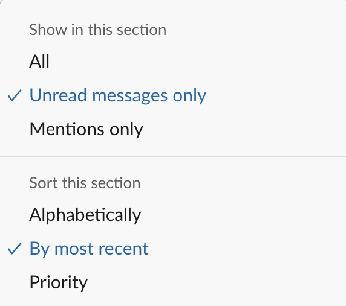
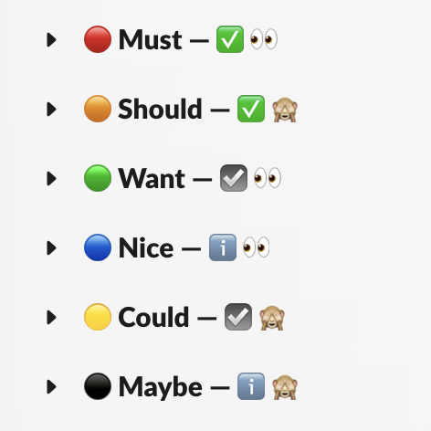

***Update 2024-02-13:** Restructure to introduce headings and highlight [the core problem](#problem) with messaging apps.*

***Update 2023-10-17:** Replace simplistic “Channels/Someday” channel organisation with a [MoSCoW](https://en.wikipedia.org/wiki/MoSCoW_method)-inspired [sections structure](#sections) optimised for fast processing.*

## 📥 Inbox zero {#inbox-zero}

“Inbox zero” is a pivotal concept to deal with the constant influx of information of modern life. [Merlin Mann coined it](https://en.wikipedia.org/wiki/Merlin_Mann#Writing) in 2006, during a [series of posts on 43Folders](http://www.43folders.com/2006/04/05/wrapup).

> That “zero?” It’s not how many mes­sages are in your inbox–it’s how much of your own *brain* is in that inbox. Especially when you don’t want it to be. That’s it.
>
> — [Internet Archive’s Wayback Machine (2011-07-12)](https://web.archive.org/web/20110712000524/http://inboxzero.com:80/)

It was not about “perfection” but rather a way for us to take back control of our time and avoid being reactive. To do that, you triage messages to focus on what matters:

1. Take fixed times in the day to go through your inboxes — close or ignore them outside of those times
2. Make decisions, not actions — triage fast and act later, so you’re not derailed into a long essays

Once you’re done for the time slot, you can get out of that “new/unread” mind space. Go back to doing your actions, according to whichever criteria you think fits best.

At the time, this concept appeared to deal with the problems of overwhelmed email inboxes. Its core principles expand beyond email though. They are essential to get out of a reactivity loop and quite generic that they apply to other areas or our life:

> Accept that almost everything in your life is an inbox
>
> — [Natasha Bernal](https://www.wired.co.uk/profile/natasha-bernal) on [Everything you thought you knew about inbox zero is wrong | WIRED UK](https://www.wired.co.uk/article/inbox-zero-mentality)

## 💬 Messaging apps problem {#problem}

Nowadays work happens on instant message applications, not email. These types of applications are quite bad in letting us apply these concepts:

* Their structure revolves around immediacy of synchronous messages and responses
* Their core unit to manipulate is the *channel*, not individual *messages*

**Slack**, in particular, is one of the worst offenders in this matter. Many of of their design decisions reinforce the notion of immediacy and having to “keep up” with it. For example:

* The frequent “X is typing” notices
* The inability to read recent messages and keep older ones unread for later

## ⏱️ The gist of the solution {#solution}

The goal is to apply the “inbox zero” concepts outlined above and mitigate the pressures to “respond immediately”.

The realisation is that *sections* can become a pseudo-inbox of *channels* that need reading (as opposed to consider *messages* as the unit to manipulate).

This is how I setup my **Slack** channels *sections* to make them behave more like an inbox:

* Show channels with [Unread messages only](https://slack.com/help/articles/212596808-Adjust-your-sidebar-preferences#choose-which-conversations-to-show)
* Sorted [By most recent](https://slack.com/help/articles/212596808-Adjust-your-sidebar-preferences#sort-your-conversations)

## 🗂️ Organise for fast processing {#sections}

* [ ] TODO: Explain the new sections format emoji 

> In practice, the most granular unit you can manage your “unreads” in Slack is the *channel*, not the *message*.
> >
> Depending on how far back I am with the backlog of ~~messages~~ channels  to read, I'm more flexible to decide at what section to stop and “mark all as read”

As for which sections to use, I’ve ended up with a MoSCoW-inspired list where I essentially answer the question for each channel:

* How directly related to my work/role is it?
    - ☑️ Yes; ⚠️ Kinda; ℹ️ Not really
* Am I keen on reading/seeing new messages on it?
    -  👀 Yes; 🙈 Nope

This is now the most battle tested setup I have stayed with for many months. Most past setups broke down on the “coming back from holidays” huge backlog of stuff to read. This one lets me manage my time/energy more effectively and use the “mark all as read” more often, once the core ones are cleared.

## 🚧 Full setup {#setup}

* [ ] TODO: Update according to the new sections format

The sidebar consists of the following sections, in this order:

1. **Starred** default section
    * Sorted [Alphabetically](https://slack.com/help/articles/212596808-Adjust-your-sidebar-preferences#sort-your-conversations) and showing [All](https://slack.com/help/articles/212596808-Adjust-your-sidebar-preferences#choose-which-conversations-to-show) channels
    * *Expanded* all the time
    * Contains conversations that I want to remain “pinned” on the top of the sidebar for a short time, regardless of read or not
    * Used for ongoing group messages or temporary channels with an active conversation for a few days or so
    * Direct messages of `@Slackbot` (notices and some mentions) and my own user `@me` (for scratch notes) are always starred here
2. **Direct messages** default section
    * Sorted [By most recent](https://slack.com/help/articles/212596808-Adjust-your-sidebar-preferences#sort-your-conversations) and showing channels with [Unread messages only](https://slack.com/help/articles/212596808-Adjust-your-sidebar-preferences#choose-which-conversations-to-show)
    * *Expanded* all the time
3. **Channels** default section
    * Sorted [By most recent](https://slack.com/help/articles/212596808-Adjust-your-sidebar-preferences#sort-your-conversations) and showing channels with [Unread messages only](https://slack.com/help/articles/212596808-Adjust-your-sidebar-preferences#choose-which-conversations-to-show)
    * *Expanded* all the time
    * This section contains *only* the channels that are ***essential** to my day-to-day work*
4. **Someday** [*custom*](https://slack.com/help/articles/360043207674-Organize-your-sidebar-with-custom-sections#create-custom-sections) section
    * Sorted [By most recent](https://slack.com/help/articles/212596808-Adjust-your-sidebar-preferences#sort-your-conversations) and showing channels with [Unread messages only](https://slack.com/help/articles/212596808-Adjust-your-sidebar-preferences#choose-which-conversations-to-show)
    * *Collapsed* most of the time
    * All the remaining channels that are less critical end up in this “catch-all” section (e.g. leisure, info, etc.)
5. **Apps** default section
    * Sorted [Alphabetically](https://slack.com/help/articles/212596808-Adjust-your-sidebar-preferences#sort-your-conversations) and showing [All](https://slack.com/help/articles/212596808-Adjust-your-sidebar-preferences#choose-which-conversations-to-show) channels
    * *Collapsed* most of the time
    * Easy access to apps I use on occasion but not so often that I remember their name

## 📨 Processing inboxes {#processing}

* [ ] TODO: Update according to the new sections format

With this, my daily process becomes, at specific times during the day:

1. Check for **Threads** updates
2. Deal with **Direct messages**
3. Process the updated **Channels**

When I have some more relaxed time, usually at the end of the day:

4. Cherry-pick from the **Someday** channels some that spark my curiosity
5. `Shift-Esc` to “mark all as read” and have an clean slate for next day

## ℹ️ Tips and tricks {#tips}

With this, channels and conversations disappeared from the sidebar once we read them. There are few options to navigate around and finding previous channels or conversations:

* Shortcut CMD-K to find and jump to a specific channel

* History 🕒 view to go back to recent chats and last visited channels

* Threads view, to see updates on conversations I choose to [Get notified about new replies](https://slack.com/help/articles/115000769927-Use-threads-to-organize-discussions-#manage-thread-notifications)

Also, to keep usage of the sidebar **Unread messages** aligned with this concept, set it to:

* Display only the **Channels** section
* Sorted from newest to oldest

## ❓ Questions {#questions}

### Does it mean that with this you have Slack under control, almost empty, and you’re very responsive?

Of course not 🙂

Days still go haywire and messages backlog accumulates. And quite often it all becomes chaotic. That’s a consequent of the environments we work in.

With this setup though, I’m able to take care of the most urgent and important messages in those chaotic days. Also, it’s easier to recover from a crazy week without the fear of missing out (<abbr title="Fear Of Missing Out">FOMO</abbr>) some interesting message.

### What about using sections to organise and classify channels by type, scope, urgency, category, etc.?

Before, I was using different sections to categorise and classify channels by themes, scope, etc. It was a way to scratch my itch for having everything well organised and in their “right” places.

I stopped doing it because it was getting hard for me to maintain them and was getting lost on too many places to check. There was no easy way to triage what was recent vs old and important vs secondary.

It was a hard to kill all those sections curated with much care, after lots of time invested. This was quite scary to do 😬 but the benefits and simplicity gained from switching to a setup optimised for *processing new stuff* have more than made up for it.

### What about the mobile app “Newest to oldest” view?

This inbox approach started in the Slack mobile app. I switched my channels list to [sort by “Newest to oldest”](https://slack.com/help/articles/212596808-Adjust-your-sidebar-preferences#sort-your-conversations) (previously called “Recent activity”). This lists updated channels under “Today”, “Yesterday”, and “Last 7 days” groupings.

This change was such huge improvement. I found myself switching from desktop to my smartphone to check Slack messages. I could focus only on the “Today” view and keep up-to-date with what was changing (even if there was some past backlog).

The only drawback was that there was no easy way to distinguish between *important* vs *unimportant* channels. Triage of what could wait for later in the “Today” section was only visual.

Shortly after, a colleague shared a similar “timeline” setup of their desktop sidebar. Inspired by it, I decided to take the plunge and experiment with this “Slack as an inbox” setup in both desktop and mobile.

---

Shared to:

* [LinkedIn](https://www.linkedin.com/posts/hugocf_slack-overload-regain-control-with-inbox-activity-7054122110918504448-yqGl)
* [Mastodon](https://mastodon.online/@hugocf/110220664447192955)
* [Medium](https://hugocf.medium.com/slack-overload-regain-control-with-inbox-zero-principles-7187fb283664)
* [Twitter](https://twitter.com/hugocf/status/1648357045609873408)

🔒 *(groups)*

* [Equal Experts Blogin](https://equalexperts.blogin.co/posts/sharing-ways-to-reduce-information-overload-201881#c237802)
* [iOS PT Slack](https://ios.slack.com/archives/C0721L3CL/p1681834179011219)
* [Springer Nature Slack](https://springernature.slack.com/archives/C04HV45EZ4H/p1681834348685239?thread_ts=1672850109.129719&cid=C04HV45EZ4H)
* [Telegram](https://t.me/c/1363309933/8632)
