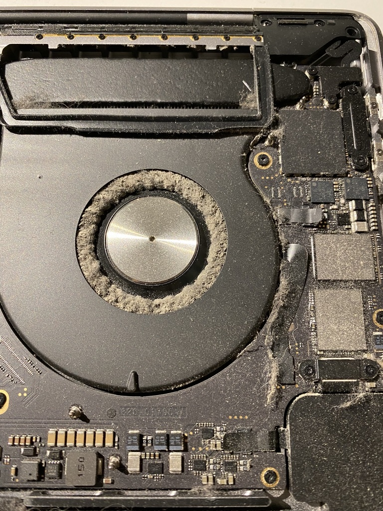

---
aliases:
  - macbook-fans
  - macbook-dust
date: 2022-08-12T22:16:16Z
lang: en
tags: [ macbooks, hardware, maintenance ]
title: "Thermal throttling: “Gone in a cloud of dust”"
summary: "When no matter how much you treat some problems as a “software” issue, there’s no escaping the “hardware” truth."
shared:
  private:
    - "[iOS PT Slack](https://ios.slack.com/archives/C024RLKFJ/p1660260446400299)"
    - "[Springer Nature Slack](https://springernature.slack.com/archives/C02M6RD1EPK/p1660299800414609?thread_ts=1657727605.821679&channel=C02M6RD1EPK&message_ts=1660299800.414609)"
    - "[Telegram](https://t.me/c/1363309933/9385)"
---

For a long time now, my company assigned **MacBook Pro** based with **Intel Core i7** silicon, had been having weird thermal throttling behaviours.

More often than not, when doing **Google Meet** calls on **Chrome**, sharing screen, and/or opening large **Miro** boards, the computer would start getting slower and slower, to the point of becoming completely useless.

Opening **Activity Monitor** would show the dreaded `kernel_task` taking a huge percentage of CPU  time.



**macOS** uses `kernel_task` to [help manage CPU temperature by making the CPU less available to processes that are using it intensely](https://support.apple.com/en-us/102172). This means that what **Activity Monitor** shows is only a “symptom”, not the cause of the “disease”.

---

I installed [**Macs Fan Control**](https://crystalidea.com/macs-fan-control) and for a while was monitoring the fans behaviour like a hawk.

It became clear that even forcing the fans to work full blast all the time, the thermal throttling would still happen in an all too regular basis.

With all the software solutions exhausted (app upgrades, clearing caches, full restarts, safe mode, etc.) and a similar report of clogged fans by a colleague, it was time to gain the courage to open up the laptop and inspect the fans directly.

Thanks to the wonderful [**iFixIt** guides](https://www.ifixit.com/Device/MacBook_Pro), the task was a fairly simple one [for that particular model](https://www.ifixit.com/Guide/MacBook+Pro+16-Inch+2019+Lower+Case+Replacement/135013).

---

The results were striking and these images speak more loudly that any words could ever do:

***Before***

| Left fan | Right fan |
|----------|-----------|
|  |  |

***After***[^fn1]

| Left fan | Right fan |
|----------|-----------|
|  |  |

Suffice to say that it works and feels like a brand new laptop now. 🎉

[^fn1]: The recommended way to clean these fans is [using a spray can of compressed air](https://superuser.com/a/199540/54980). In my particular case, having none of those around, I used a [very low suction portable vacuum and a small brush](tools.jpg) (to loosen the harder bits) but please follow the recommendations due to the risk of damaging the fans (if the air flow causes them to spin too fast) or other electronic components (from the static electricity generated).
